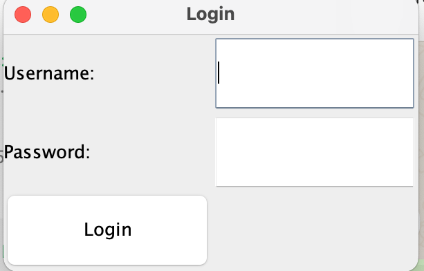
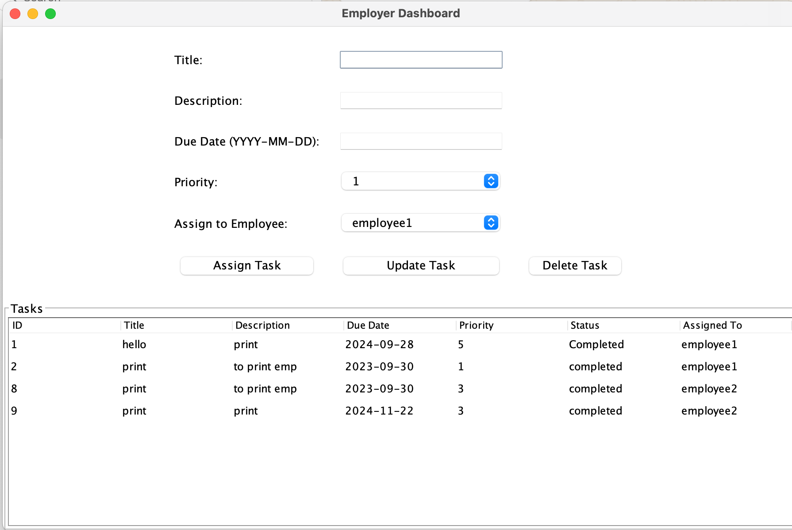
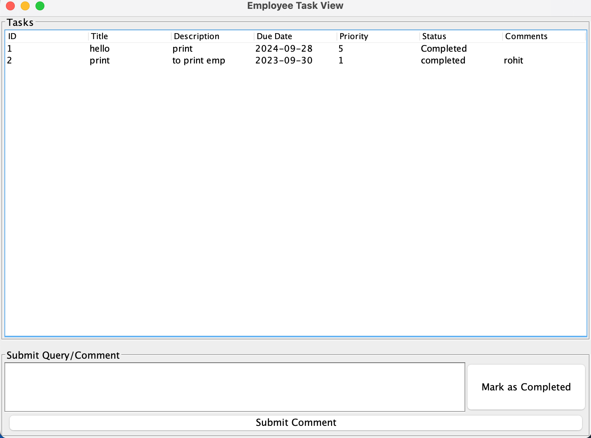
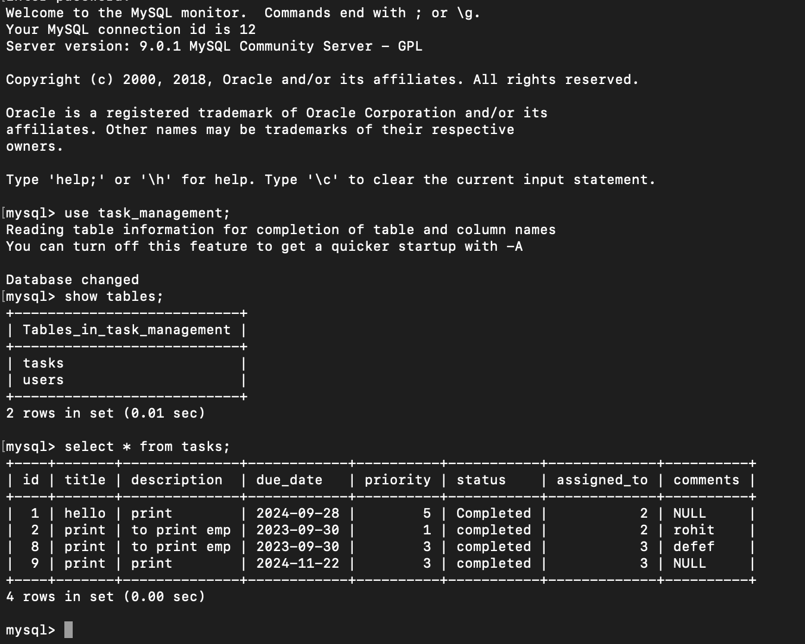

# Task Management System

Welcome to the **Task Management System**! This Java-based application is designed to help employers and employees manage tasks efficiently. Employers can assign tasks with specific deadlines and priorities, while employees can track and complete tasks on time.

## Table of Contents
- [Project Overview](#project-overview)
- [Features](#features)
- [Technologies Used](#technologies-used)
- [Setup Instructions](#setup-instructions)
- [Usage](#usage)
- [Database Schema](#database-schema)
- [Contributing](#contributing)
- [License](#license)

---

## Project Overview

The **Task Management System** is built using Java Swing, AWT, and JDBC for the backend and MySQL for data storage. The system provides:
- An **Employer Dashboard** to assign, monitor, and manage tasks for employees.
- An **Employee Dashboard** to view assigned tasks, mark tasks as completed, and raise queries.

This project is ideal for small teams to streamline task assignments and track project progress.

## Features

### Employer Dashboard
- Assign tasks to employees with specific deadlines and priority levels.
- View all assigned tasks and track their completion status.
- Address employee queries related to assigned tasks.

### Employee Dashboard
- View assigned tasks with details like deadlines and priority levels.
- Mark tasks as completed once done.
- Raise queries related to specific tasks.

### Authentication
- **Login Page** for user authentication (employer or employee access).

## Technologies Used

- **Java Swing** - For GUI components.
- **Java AWT** - For GUI event handling.
- **JDBC** - For MySQL database connectivity.
- **MySQL** - Database management for storing and retrieving tasks, users, and queries.

## Setup Instructions

### Prerequisites
- Java Development Kit (JDK) 8 or above.
- MySQL Server.
- An IDE such as IntelliJ IDEA, Eclipse, or NetBeans.

### Installation

1. **Clone the repository**:
   ```bash
   git clone https://github.com/yourusername/Task_Management_System.git
   cd Task_Management_System
2. **Set Up MySQL Database**:
   - Create a new database in MySQL (e.g., `task_management`).
   - Import the provided SQL schema (found in the `schema.sql` file) to create the necessary tables and relationships.
   - Update the `DBConnection.java` file with your MySQL credentials.

3. **Configure the Environment**:
   - In the root directory of your project, create a `.env` file to securely store your database credentials. Add the following lines:
     ```plaintext
     DB_USER="your_db_username"
     DB_PASSWORD="your_db_password"
     DB_NAME="task_management"
     ```

4. **Run the Application**:
   - Open the project in your preferred IDE.
   - Compile and run the application. You should now be able to access the login screen.

## Usage

1. **Login**  
   - Users start on the login page, where they can log in as either an employee or employer.
   - 

2. **Employer Dashboard**  
   - Once logged in as an employer, users can assign tasks, set deadlines, and specify priority levels.
   - Employers can view all tasks, monitor progress, and respond to employee queries.  
   - 

3. **Employee Dashboard**  
   - Employees can view their assigned tasks, mark them as completed, and communicate directly with employers through a query section.
   - Completed tasks will update on the employer's dashboard in real-time.  
   - 

## Database Schema

Here’s an overview of the main tables in the database:

- **Users Table**: Stores details for each user, including their role (either `employer` or `employee`), `user_id`, `name`, `email`, and `password`.
- **Tasks Table**: Contains information about each task, such as `task_id`, `assigned_to` (employee ID), `priority`, `status`, and `deadline`.
- **Queries Table**: Tracks queries raised by employees about specific tasks.

The exact SQL schema is shown below:


## Contributing

Contributions are welcome! Here’s how you can help:
1. Fork the repository.
2. Create a new branch for your feature or bug fix (`git checkout -b feature/your-feature`).
3. Commit your changes (`git commit -m "Add some feature"`).
4. Push to the branch (`git push origin feature/your-feature`).
5. Open a pull request.

## License

This project is licensed under the MIT License. See the [LICENSE](LICENSE) file for details.


